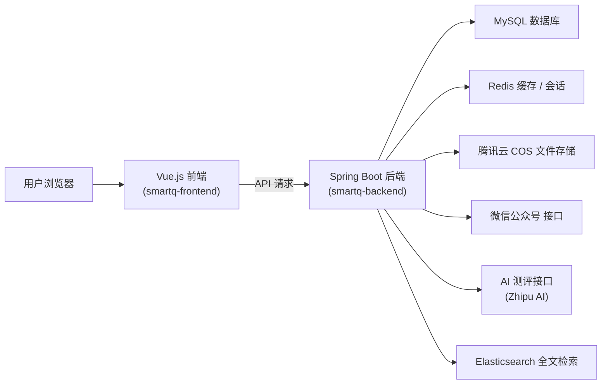
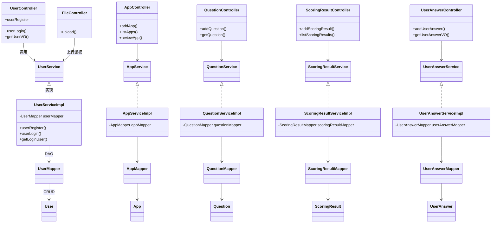

# SmartQ – 基于 Spring Boot 的智能问卷系统

## 项目简介
网址: 193.112.187.169

**SmartQ** 是一个支持用户创建和分享在线问卷/测评的小型平台。用户可以在平台上创建**测评应用（App）**，包括设置问题和结果评估逻辑，其他用户则可以参与答题并获得测评结果。项目特色在于引入了 AI 技术进行智能评分：除了传统的固定评分规则外，还可调用大模型（如 Zhipu AI 的 ChatGLM）对用户的答案进行分析，生成个性化的测评结果描述。

主要的业务场景包括：

- **在线测评制作**：用户（一般为管理员或创作者）可以创建测评 App，编写题目和选项，设定评分策略（支持固定分值或 AI 分析）。管理员审核通过后，测评才可发布给其他用户使用。
- **用户参与答题**：普通用户登录后可以选择测评进行作答，提交答案后系统根据预设规则或 AI 计算得出评分结果，反馈给用户。
- **结果展示**：测评结果包含一个结果类别名称、描述、图片等，可供用户查看甚至分享。对于AI评分的测评，结果描述由AI自动生成，更加智能生动。

**项目架构**采用前后端分离模式：后端为 Spring Boot 构建的单体应用，提供 RESTful API；前端为基于 Vue.js 的单页应用（SPA），通过 AJAX 调用后端接口。整体部署架构相对简单，属于典型的**分层单体应用**。如下架构图所示：

后端系统为单体架构（Monolithic），通过模块划分实现清晰的分层；同时对外集成了多种周边组件（如上图所示）以满足业务需求。例如，使用 MySQL 持久化业务数据，使用 Redis 实现缓存和分布式会话，集成腾讯云 COS 对象存储用于用户上传头像等文件，整合微信公众平台接口便于从微信公众号接入用户，以及计划利用 Elasticsearch 提升检索性能等。

**主要技术栈和中间件**如下：

- 后端框架：**Spring Boot 2.7.2**为核心容器和Web框架，采用 Spring MVC 构建 REST API；基于 Spring AOP 和 Scheduling 实现日志、权限等切面及定时任务。
- 持久化层：**MyBatis-Plus 3.5.2** ORM 框架，用于简化数据库CRUD操作。数据库采用 **MySQL**，通过 MyBatis-Plus 提供的 Mapper 接口执行 SQL。同时配置了 **Spring Data Redis** 及 **Redisson** 用于缓存和分布式锁。
- 前端框架：**Vue.js 3** (使用 TypeScript)。前端项目使用 Vue CLI 脚手架生成，典型的 Vue 单页应用结构，组件化开发，通过 Axios 等与后端交互。
- 文档与接口测试：集成 **Knife4j** (Swagger 增强界面) 生成在线 API 文档, 便于调试和对接前端。
- **Elasticsearch**：计划中的全文检索引擎，用于对帖子内容等进行检索（目前配置已集成但默认关闭，需要在application.yml中开启配置）。
- **AI 接口**：对接了 **Zhipu AI 平台**（即智谱AI）的 ChatGLM 大模型，通过其提供的 API（ClientV4 SDK）调用聊天模型用于测评结果生成。项目中使用了开发者提供的 API-Key，并封装了 `AiManager` 来统一管理 AI 请求。
- 第三方库：**MyBatis-Plus** 附带的 `ServiceImpl` 基类加速开发，**Hibernate Validator** 注解用于参数校验，**Lombok** 简化实体和DTO的代码编写，**Hutool** 工具库辅助 JSON、文件等操作, **EasyExcel** 用于导出 Excel 报表等。
- 中间件：**Redis** 用于分布式 Session（Spring Session）及缓存实现（例如缓存AI评分结果），**腾讯云 COS** 用于文件上传存储（通过 `CosManager` 封装调用其 SDK），**微信公众号 SDK** (Wechat MP) 用于处理公众号消息和菜单等（目前相关代码已注释停用）。

总体而言，SmartQ 项目功能完整且亮点突出：**支持自定义和 AI 智能评分的在线测评系统**，并结合了**权限控制**、**内容管理**、**数据统计**等通用模块，技术方案上采用主流的 Spring Boot + Vue 架构，具有良好的学习和扩展价值。

## 系统架构设计

### 分层架构与模块划分

SmartQ 后端采用经典的三层架构进行代码划分，每一层在项目中对应不同的包结构，实现职责单一、依赖清晰：

- **Controller 层（接口层）**：位于 `com.cf.smartq.controller` 包下，包含各个领域的控制器类，如 `UserController`, `AppController`, `QuestionController`, `UserAnswerController`, `FileController` 等。Controller 负责接收和处理 HTTP 请求（REST API），对请求参数进行基本校验，调用相应的 Service 完成业务处理，并将结果包装为统一响应对象返回。比如 `UserController` 提供了用户登录、注册接口，`AppController` 提供了测评应用的增删查改接口等。
- **Service 层（服务层）**：定义在 `com.cf.smartq.service` 包，下设接口和实现两部分。业务接口以`XxxService`命名，定义了领域对象的核心业务方法；实现类以`XxxServiceImpl`命名，位于 `service.impl` 子包中，主要包含业务逻辑处理、跨模块协调、事务控制等。Service 通常会调用多个 DAO 方法以完成一个完整业务，并对输入输出做进一步处理。比如 `UserServiceImpl` 实现用户注册时，要校验账号唯一性、对密码加密后再保存。
- **DAO 层（数据持久层）**：由 MyBatis-Plus 的 **Mapper 接口** 承担，位于 `com.cf.smartq.mapper` 包下。每个实体对象对应一个 Mapper，例如 `UserMapper`, `AppMapper`, `QuestionMapper` 等，继承自 MyBatis-Plus 提供的 `BaseMapper<T>` 接口。Mapper 层通过注解或 XML 配置与数据库表结构映射，封装了常用的 CRUD 操作。Service 直接调用 Mapper 方法即可对数据库进行操作。由于使用了 MyBatis-Plus，大部分基础SQL由框架自动生成，如根据主键查询、更新等，无需开发者手写 SQL。此外，项目针对复杂查询也会在 Service 中利用 MyBatis-Plus 的链式查询（Wrapper）来构造条件。

上述三层以**依赖倒置**的方式组织：上层依赖下层接口（例如 Service 调用 Mapper 接口方法而非具体实现），从而降低耦合。实际运行时，由 Spring IoC 容器进行依赖注入，将各层实现组装起来。

除了主要的业务层次，项目中还有一些**支撑模块**：

- **Model 层（领域模型）**：位于 `com.cf.smartq.model` 包下，细分为 `entity`、`dto`、`vo` 等子包：
  - `entity` 子包定义了与数据库表对应的实体类。例如 `User`, `App`, `Question`, `UserAnswer`, `ScoringResult`, 以及帖子的 `Post` 等)。这些类使用 MyBatis-Plus 的注解（如 @TableName 等）标明对应的表名和字段，并通过 Lombok @Data 提供Getter/Setter。实体类主要反映数据库结构，是DAO层的操作对象。
  - `dto` 子包下按功能划分为多个DTO类，用于封装请求参数或业务处理中的中间数据。例如 `PostAddRequest`, `UserAnswerAddRequest` 等是创建操作的请求数据封装。DTO通常附带校验注解以确保参数合法性。
  - `vo` 子包下是返回给前端的视图对象（View Object），用于封装需要展示或输出的字段。例如 `UserVO`, `AppVO`, `UserAnswerVO` 等。VO一般由实体转化而来，避免直接暴露敏感字段，并根据需要添加额外信息。
- **配置与工具模块**：
  - `com.cf.smartq.config` 包含配置相关的类，如 `RedissonConfig` 用于初始化 Redisson 客户端配置，以支持Redis相关操作和分布式锁。
  - `com.cf.smartq.constant` 定义了一些常量，例如 `UserConstant` 包含用户角色常量（`DEFAULT_ROLE`, `ADMIN_ROLE`等）和Session键等，`FileConstant` 定义文件上传的常量（例如COS访问域名等）。
  - `com.cf.smartq.common` 定义了通用的响应模型 `BaseResponse`、错误码枚举 `ErrorCode`、结果工具类 `ResultUtils` 等，用于标准化 API 输出格式。比如所有接口返回 `BaseResponse<T>`，内部含 code, message, data 字段，调用 `ResultUtils.success(data)` 快速构造成功响应)。
  - `com.cf.smartq.exception` 定义了业务异常 `BusinessException` 及断言工具 `ThrowUtils`，用于在校验失败时抛出标准异常。全局会有异常处理器将 BusinessException 转换为友好的错误响应。
  - `com.cf.smartq.utils` 一些工具类，如 `SqlUtils` 提供避免 SQL 注入的转义方法等。
- **AOP 切面模块**：`com.cf.smartq.aop` 中定义了两个切面：
  - `LogInterceptor` 实现了全局请求日志记录。通过 `@Around("execution(* com.cf.smartq.controller.*.*(..))")` 切入所有控制器方法，打印请求的路径、参数以及执行时间。
  - `AuthInterceptor` 则是自定义的权限检查切面，用于处理自定义注解`@AuthCheck`。在执行标记了该注解的方法前进行拦截，根据注解参数要求的角色验证当前用户是否有权限。如果未登录或角色不符则抛出无权限异常。这样在 Controller 方法上简单加一行 `@AuthCheck(mustRole = "admin")` 就能实现管理员权限控制，代码优雅且避免重复校验逻辑。
- **Manager 模块**：`com.cf.smartq.manager` 封装对接外部服务的操作，例如：
  - `AiManager` 封装 AI 接口的调用，内部持有 `ClientV4`（智谱AI提供的SDK客户端）。提供了同步请求方法 `doSyncStableRequest` 等，用于向大模型发送消息并获取回复。它构造了 ChatGLM 所需的对话消息列表（System和User角色信息），调用模型并返回结果JSON。
  - `CosManager` 封装腾讯云 COS 的操作，例如 `putObject` 上传文件等。这样 Controller 调用时只需关心业务，具体的云存储实现细节由 CosManager隔离。
- **Job 定时任务**：`com.cf.smartq.job` 包下可放置定时任务，如 `IncSyncPostToEs`（增量同步帖子数据到ES，每分钟执行一)用于将最近更新的帖子索引到 Elasticsearch，提高搜索效率。目前该任务组件处于未启用状态（`@Component` 注释掉），视需要可以打开。
- **代码生成器**：`com.cf.smartq.generate.CodeGenerator` 是一个离线运行的代码生成工具。利用 Freemarker 模板，开发者可快速生成标准的增删改查模块代码，包括 Controller、Service、DTO/VO 等。通过设置数据模型中的实体名等参数，运行 main 方法会在 generator 目录下输出相应代码框架。这在需要新加业务实体时非常方便，保持代码风格一致。

### 核心功能模块逻辑

以下简要说明系统中几个核心模块及其主要类的职责和调用关系：

- **用户与权限模块**：包括 `UserController` 和 `UserService`。提供用户注册、登录、注销、权限验证等功能。注册逻辑在 `UserServiceImpl.userRegister` 中实现，包含用户名唯一性校验、密码盐值MD5加密等步骤。登录则校验账号密码后，将用户信息保存到 Session 中用于维持登录状态。用户角色分为普通用户和管理员，在登录后可通过 `UserService.isAdmin` 判断。当需要管理员权限的操作，在对应 Controller 方法上增加 `@AuthCheck(mustRole = "admin")` 注解，由 AuthInterceptor 自动拦截校验。这样保证了例如删除测评应用、审核等接口只有管理员可调用。

- **测评应用模块**：对应 `AppController` 和 `AppService`。**测评应用（App）**是平台的核心数据，代表一套问卷/测评。创建应用时需要填写名称、描述、图标等基本信息，以及选择应用类型和评分策略。App 分两类：0-得分类（数值型评分），1-测评（角色型或人格测评）；评分策略分两种：0-自定义（固定规则评分），1-AI评分。App 创建后默认为待审核状态，管理员在后台审核通过（reviewStatus从0改为1）后普通用户才能在前台看到并作答。AppServiceImpl 中主要维护 App 的增删改查接口，以及审核操作等。数据保存于 app 表，每条记录关联创建人 userId 和审核人 reviewerId 等字段。

- **题目管理模块**：每个测评应用有对应的 `Question` 实体，用于存储具体题目和选项内容。题目内容采用 JSON 格式存储在 `Question.QuestionContent` 字段中。这样可以在一个字段里描述一个或多个具体问题及其选项列表。通过定义 `QuestionContent` DTO 类，将 JSON 解析为对象结构：题目列表包含多个 QuestionContent，每个包含题干(title)和选项列表，每个选项有键、值，及对应的分数或结果属性。如果应用是得分类测评，每个选项有一个数值分数用于累计总分；如果是角色测评类，每个选项携带一个结果属性（如人格维度I/E等）。`QuestionController` 提供接口让创建者提交题目内容，底层由 QuestionService 保存 JSON 数据。作答时需要将题目内容取出，与用户选择进行比对评分。

- **评分结果模块**：对于自定义评分的测评，需要预先定义**结果类别**。`ScoringResult` 实体表示一个测评应用可能的结果类别，包含结果名称、描述、图片，以及对应的**分数范围或属性集合**。例如某性格测试App可能有结果类别“外交型性格”，描述对应特征，当用户得分≥80分时命中该结果)。又如角色测评类，把不同人格字母组合当作 resultProp属性，统计匹配最高的组合。创建测评时，创作者需要通过 ScoringResultController 添加若干结果类别。每条 ScoringResult 记录关联所属App（appId）和创建者userId。

- **用户答题与评分模块**：用户答题提交由 `UserAnswerController` 处理，是系统最关键的流程之一。一个 `UserAnswer` 实体记录了用户对某次测评的作答情况和评分结果。主要字段包括应用ID、用户ID、用户所选的**答案选项集合**（choices，以JSON数组存储），评分策略，同步存储的评分结果（resultId、结果名称/描述、得分等。当用户提交答案时，控制器会先校验应用存在且已审核通过。然后将用户选项列表序列化存入 UserAnswer，并调用 **评分流程**。评分根据App配置采用不同策略：

  - *自定义评分*：如果是数值型得分（appType=0, scoringStrategy=0），系统会按照预先设定的分值累计总分，然后匹配对应分数范围的结果类别。该逻辑通过策略模式实现，详见下文“设计模式”。简单来说，系统会读取该App的所有ScoringResult定义，根据每个结果的resultScoreRange判断用户总分落在哪个区间，然后将UserAnswer的result字段设置为该结果类别。
  - *角色评分类自定义*（appType=1, scoringStrategy=0）：对于人格测评这类应用，评分不只是算分，而是统计选项对应的属性出现次数。例如MBTI测试，选项标记为I/E等属性。系统会统计用户选择中各属性频次，然后计算每个结果类别（其resultProp存储了一组属性组合）的匹配得分，选出最高分的结果类别。在 `CustomTestScoringStrategyImpl` 策略实现中可以看到此逻辑：遍历用户选项统计 optionCount，再遍历每个 ScoringResult 的属性列表计算分数，最后选出最大值对应的结果，将其名称、描述填入 UserAnswer。
  - *AI 智能评分*：如果应用选择了AI评分（scoringStrategy=1），则由AI服务来生成结果。对于得分类测评（appType=0），实现类 `AiScoreScoringStrategyImpl` 先计算用户总分、构造提示包含应用描述、用户总分和问答列表，通过 `AiManager` 请求大模型生成评价。AI返回一个JSON结果（包括 resultName 和 resultDesc），系统解析后填充到UserAnswer对象，并记录总分。对于角色测评类的AI评分（appType=1），逻辑类似，类 `AiTestScoringStrategy` 构造的问题列表略有不同，但都是由AI自由发挥给出结果名称和长文本描述。引入AI后，测评的结果不再局限于预定义类别，可以是更加**个性化**的反馈，例如具体建议或分析报告。

  在 UserAnswerController 的实现中，提交答案会调用 `ScoringStrategyExecutor` 来统一执行上述不同策略：可以看到，当新增 UserAnswer 保存后，调用了 `scoringStrategyExecutor.doScore(choices, app)` 获取评分结果，再将结果更新回数据库。该执行器利用策略模式，根据 App 的类型和策略选择匹配的 `ScoringStrategy` 实现并调用，实现了评分算法的解耦和灵活扩展。

以上模块相互协作完成用户从创建测评、参与答题到获取结果的完整业务流。下面给出系统主要类之间的调用关系 UML 图，以突出 Controller -> Service -> Mapper -> Entity 的层次结构和依赖：

通过以上架构设计，系统实现了清晰的分层：表示层、业务层、数据层各司其职。同时利用 Spring 的依赖注入和 AOP，使得事务管理、日志、安全等横切关注点得到统一处理，降低了模块之间的耦合度，提升了代码可读性和可维护性。

## 技术要点总结

### 1. 使用的设计模式

- **策略模式（Strategy）**：在评分逻辑中大量使用。通过定义 `ScoringStrategy` 接口和不同实现类，将不同类型测评的评分算法分别封装。如前述 `CustomTestScoringStrategyImpl`, `AiScoreScoringStrategyImpl`, `AiTestScoringStrategy` 等。系统在运行时根据App的类型和所选策略从 `scoringStrategyList`（所有实现Bean的列表）中匹配到合适的策略并调用。这一模式让新增评分算法非常方便，遵循“开闭原则”：无需修改原有代码，只需添加新的策略实现并用注解声明适用场景即可，ScoringStrategyExecutor会自动识别。
- **AOP 切面（Proxy Pattern）**：利用 Spring AOP 实现了日志记录和权限控制两大横切功能。通过在方法执行前后织入代理逻辑，实现类似**代理模式**的效果。例如权限校验AuthInterceptor实际是一个环绕代理，它在目标方法执行前后加入角色验证逻辑。相比在每个Controller方法手动检查session用户，这种AOP方式减少了重复代码。此外，日志切面(LogInterceptor)对所有Controller进行了代理，统一输出请求日志。AOP的运用体现了面向切面编程思想，使日志、安全等与业务逻辑解耦。
- **单例模式（Singleton）**：项目多数 Bean 由 Spring 容器管理，默认都是单例。如 `AiManager`, `CosManager`, `UserServiceImpl` 等在整个应用运行期间只有一份实例被反复调用。这样重用资源、避免不必要开销。例如AiManager内部维护了一个ClientV4和线程池，作为单例使用能够避免频繁创建销毁，提高性能。
- **Builder 模式**：在部分模型类中使用 Lombok 的 `@Builder` 注解，便于构建对象。例如 `QuestionContent` 和内部的 `Option` 使用了 Builder 模式，在解析或构造 JSON 时可读性更好。开发中可通过链式调用灵活创建复杂对象。
- **工厂/模板方法**：虽然没有显式实现经典的工厂类，但在集成 MyBatis-Plus 后，Mapper相当于由框架生成的DAO工厂，封装了不同实体的CRUD方法。还有 CodeGenerator 的 Freemarker 模板，可以视为编译期的模板方法应用——根据统一模板生成不同代码，大大减少重复劳动。
- **观察者模式**：项目未直接实现事件机制，但可类比在用户登录成功后，将用户对象存入Session，让后续请求“观察”Session来判断登录状态。这并非经典Observer实现，但用了类似思想（状态改变通知后续流程）。如果需要，也可以引入Spring Application Event机制实现真正的事件发布-订阅，目前未用到。

### 2. 并发处理与性能优化

- **线程安全和锁机制**：对于关键的并发场景，项目做了一定处理。例如用户注册和用户点赞功能使用了**同步代码块**防止并发冲突。`UserServiceImpl.userRegister` 方法里对同一账号的并发注册通过 `synchronized (userAccount.intern())` 来串行化，避免出现重复账号。点赞功能中（代码片段已注释）也是用 `synchronized (String.valueOf(userId).intern())` 将同一用户的点赞操作串行执行，并结合 `@Transactional` 保证原子性。这些做法保证了并发环境下数据的一致性。不过上述锁是JVM本地锁，在多实例部署时无效，因此项目引入了 Redisson，可以扩展为使用分布式锁（如 `RLock`）来支持多机并发。
- **缓存和Session优化**：项目在多处使用缓存思想来提升性能。一是集成了 **Spring Session + Redis** 实现分布式会话管理，将用户Session存储在Redis，便于将来水平扩展时各实例共享登录态（application.yml中有相关配置）。二是对于一些高成本的操作，比如 AI 评分，采用了 **本地缓存Caffeine** 来暂存结果。Ai策略实现中用 Caffeine 缓存最近请求过的答案结果5分钟，下次相同答案直接返回缓存，避免重复耗时的API调用。缓存过期时间设置较短以平衡新鲜度和性能。除此之外，MyBatis-Plus 默认启用了一级缓存（会话级别），重复查询相同主键的数据在一个事务中会直接返回缓存结果。
- **分页与限流**：所有列表查询接口都采用了分页查询，避免一次性查询大量数据。在接口层通过 `Page<T>` 对象返回分页结果，前端需指定 current和pageSize等参数。代码中还人为限制了每页最大大小，如`listPostVOByPage`接口限制 pageSize 不得超过20，以防止恶意请求大数据量导致性能问题。对于潜在的爬虫行为，也可在接口层增加校验或滑块验证码等进一步限流（当前实现了简单大小限制）。
- **异步与任务调度**：应用启动时通过 `@EnableScheduling` 开启了 Spring 自带的调度器。`IncSyncPostToEs` 任务配置为每分钟跑一次增量同步，将最近更新的帖子批量写入ES索引。这种**延迟异步**更新模式避免了每次帖子更新时实时操作ES而带来的开销与耦合，通过定时批处理提高了吞吐量和响应速度。虽然帖子功能暂未开放，但此方案体现了以时间换空间的性能优化思路。此外，如果将来需要长耗时操作（如邮件通知等），也可考虑引入异步任务或消息队列，目前项目尚未用到。
- **数据库性能优化**：在数据库层面，采用了合理的索引和查询优化。所有表均以自增或雪花ID为主键，并对常用查询字段添加索引。例如 user 表的 userAccount 字段应该建立唯一索引，用于登录校验；UserAnswer 表的 appId、userId 字段宜建立索引，以便按测评或按用户查询作答记录时快速定位。MyBatis-Plus 的条件构造器底层会生成优化的 WHERE 子句，并且在更新点赞数这种操作中，直接使用了SQL片段实现原子自增而非读-改-写，减少了数据库交互次数。配置上开启了 MySQL 的**逻辑删除**（在 application.yml 中配置了逻辑删除字段 isDelete，删除操作并不真的删除行而是打标记，这样避免频繁的物理删插，提升了数据操作性能并保留数据以便审计或恢复。
- **前端性能**：前端作为SPA，通过路由懒加载和构建优化提高性能。例如Vue会将不同页面组件分块打包，首次加载必要资源，后续页面按需加载，从而加快首屏速度。同时利用浏览器缓存和CDN加速静态资源（如果部署配置了的话）。另外，前端对接口调用做了统一封装和错误处理，当后端出现401未登录等错误时会自动重定向登录，提升用户体验和交互性能。

总体来看，项目在关键操作上都考虑了一定的并发安全和性能优化：**用锁保证一致性，用缓存换取速度，用分页控制流量，用异步提升吞吐**。这些措施保证了在中小规模流量下系统的稳定和高效。

### 3. 数据库设计

SmartQ 的数据库采用 MySQL，实现了较为规范的范式设计和扩展性。主要表结构及关系如下（省略部分非核心字段）：

- **user**（用户表）: 用户的基本信息和账号凭证。字段包括：`id` (主键)、`userAccount` (账号, 唯一索引)、`userPassword` (密码, MD5加密存储)、`userName` (昵称)、`userAvatar` (头像URL)、`userProfile` (个人简介)、`userRole` (角色：user/admin/ban) 等。另外还有 `unionId`, `mpOpenId` 用于关联微信用户（用于微信登录场景）。逻辑删除字段 isDelete 通过注解启用，在删除用户时并不真正物理删除。**用户表与其他表通过 id 产生一对多关系**：一个用户可以创建多个测评App、多个题目、多个结果定义，也可以提交多个答卷等。在应用层通过 userId 关联。
- **app**（测评应用表）: 存储测评的定义。主要字段：`id`、`appName` (应用名称)、`appDesc` (应用描述)、`appIcon` (图标URL)、`appType` (类型：0分数/1测评))、`scoringStrategy` (评分策略：0自定义/1AI)、`userId` (创建者ID)、`reviewStatus` (审核状态：0待审/1通过/2拒绝)、`reviewerId` 和 `reviewTime` (审核人及时间) 等。**App 与 User 是多对一**关系，每个App由某个用户创建（userId外键）。AppID 被 Question、ScoringResult、UserAnswer 等引用，是各子表与app表关联的外键。
- **question**（题目表）: 保存测评题目的内容。字段：`id`、`appId` (所属应用ID)、`questionContent` (题目内容JSON)`userId` (创建人ID)等。questionContent JSON 中包含题目和选项列表，结构见前述 `QuestionContent` 定义。**Question 与 App 是一对一**关系（假设每个App只有一组题目JSON），通过 appId 关联。题目内容作为JSON存储是为了灵活性，允许存放复杂结构；缺点是无法直接用SQL查询内部内容，但测评问题一般不需要复杂查询，读取时在应用层解析即可。
- **scoring_result**（评分结果表）: 定义了测评应用可能输出的结果类别。字段：`id`、`resultName` (结果名称)、`resultDesc` (详细描述)、`resultPicture` (结果配图URL)`resultProp` (结果属性集合JSON)、`resultScoreRange` (得分范围下限)8)、`appId` (所属应用)、`userId` (创建人) 等。对于得分型测评，resultScoreRange用于判定该结果的分数阈值（如≥80分）；对于人格测评类，resultProp存储对应的人格特质列表（如["I","N","T","J"]）。**ScoringResult 与 App 是一对多**关系，一个App可以有多个结果类别选项。UserAnswer 会保存命中的结果ID。通常我们会对 appId 加索引，以便快速查询某应用的所有结果定义用于评分匹配。
- **user_answer**（用户答卷表）: 记录用户提交的测评答案及评分结果。字段：`id`、`appId` (测评应用、`appType`、`scoringStrategy` (冗余存储应用的类型和评分方式，用于判定采用哪个评分逻辑)、`choices` (用户所选答案列表JSON)`resultId` (评分结果对应的结果类别ID、`resultName`/`resultDesc`/`resultPicture` (将结果名称/描述/图片冗余存储，方便直接读取)等。**UserAnswer 与 App、User 都是多对一关系**，即一个用户可以提交多次不同App的答卷（也可以对同一App答多次，系统目前未限制重复答题）。这里对 appId 和 userId 建立联合索引，可以很快地查询某用户在某应用上的答题记录。因为存储了 resultId，如果评分结果是预定义类别，可通过JOIN关联到 scoring_result 表获取更详细信息；但同时我们也直接保存了结果名称和描述，这属于空间换时间的做法，方便直接读取显示。
- **post / post_thumb / post_favour**（帖子、点赞、收藏表）: 这些表属于扩展的社区功能。**post** 表字段包括 id、title、content、tags(JSON数组标签)、userId(作者)、favourNum、thumbNum 等；**post_thumb** 表用于记录用户给帖子点赞（userId + postId 组合唯一，每个用户对同一帖子只能点赞一次），**post_favour** 类似记录收藏。Post 与 User 是多对一（一个用户可发多篇帖子），PostThumb/PostFavour 与 User、Post 各是多对一。已经针对点赞收藏实现了事务和同步锁防并发，加了唯一索引避免重复记录。帖子内容可被ES索引以提高搜索效率。
- 其他：项目没有单独的 **权限或角色表**，用户角色直接存在 user.userRole 字段中，这简化了设计。由于涉及微信登录，user表存储了 unionId 和 mpOpenId，但并未设计 oauth 表，这部分逻辑简单处理即可。文件上传没有文件记录表，只在业务需要的地方存了URL，实际文件内容都存放在腾讯COS，通过文件路径访问。

数据库设计充分考虑了**查询需求**和**扩展性**：

- 采用了**范式设计**，避免数据冗余，大部分关联通过ID引用，同时在应用层做了必要的冗余（如UserAnswer冗余结果信息）来减少联表查询成本。
- 合理添加索引保证常用查询的性能，比如userAccount、unionId等字段都应该各自唯一索引，用于登录检查和微信登录查找用户；各子表的appId、userId字段都有索引以优化关联查找。
- 利用了**JSON字段**存储灵活结构：题目内容和结果属性等难以预先确定列的结构，用JSON可以方便存取。但对这类字段的查询支持有限，好在这些内容一般仅用于读取与计算，不会作为筛选条件，所以影响不大。
- **事务设计**方面，所有增删改涉及多表的操作都通过Service层封装，在一个事务中完成。如点赞操作既要插删除记录又要更新帖子计数，就通过 `@Transactional` 保证原子性。MyBatis-Plus 默认对单表CRUD也开启事务。因此能够确保数据一致性。
- **逻辑删除**的使用使得删除操作对用户透明且可逆，提高了安全性。定期可以清理逻辑删除的数据或利用 isDelete 字段过滤。
- 未提及的如 **外键约束**，在DDL上可以考虑加外键以确保引用完整性，不过由于应用小且可能出于性能考虑，代码层已经保证了关联一致性，所以实际上可能未在数据库层使用外键约束（通过应用逻辑检查和删除时级联处理来保证）。

### 4. 其他技术细节

- **参数校验**：后端接口广泛使用 **JSR 303** 注解对参数进行校验。例如实体和 DTO 上标注了 @NotNull, @Size, @Pattern 等。在Controller方法参数上结合 `@Valid` 注解可自动触发校验，若不满足约束会抛出异常。这样保证了不合法请求不会进入业务逻辑。例如 UserRegisterRequest 会校验账号、密码非空且长度限制，User实体也对账号格式、密码等有限制。这个机制提高了健壮性。
- **统一响应封装**：使用 `BaseResponse<T>` 作为统一返回对象，封装了状态码、消息和数据三部分。ResultUtils提供了便捷方法如 success()和 error()来构建响应。同时通过全局异常处理将 BusinessException 中的 ErrorCode 转换为相应错误响应。这使得前端可以方便地根据 code 判断结果类型并提示用户。
- **Swagger/Knife4j 接口文档**：应用集成了 Knife4j，使得后端API文档自动生成并可以在线查看测试。在控制器方法上使用注解（如 @ApiOperation）描述接口。启动项目后，可在 `http://localhost:8101/doc.html` 访问Knife4j页面，查看所有接口的说明、参数和试调。这对于前后端联调和第三方对接很有帮助。
- **前端路由与鉴权**：前端采用 Vue + Vue Router 构建SPA，划分了多个页面组件（如 HomePage.vue、AddAppPage.vue、DoAnswerPage.vue 等）。利用前端路由守卫和后端提供的会话接口实现登录鉴权——未登录用户访问需要登录的页面会被重定向。前端的 `access` 目录定义了权限枚举和检查函数，比如只有管理员才可访问审核页面。前端在请求API时会附带Session凭证（如cookie），后端通过 Spring Session 从 Redis 验证用户身份，达到了前后端分离下的登录态保持。
- **文件上传**：`FileController` 提供了文件上传接口，将用户上传的文件（主要是头像或图片）先暂存服务器再上传至腾讯COS。调用 `multipartFile.transferTo(file)` 保存临时文件，然后通过 `cosManager.putObject` 将文件流上传云存储。成功后返回COS的公网访问URL给前端。在上传过程中校验了文件大小和类型，目前仅允许1MB以内的jpeg/png等常见图片作为头像。文件目录按照业务类型和用户ID分类存储，避免不同用途文件混杂。通过云存储可以减轻本地服务器压力，并利用其CDN加速能力，提高图片加载速度。

## 环境要求与启动方式

要运行此项目，请确保具备以下环境和步骤：

**后端运行环境：**

- JDK 1.8 或以上版本（本项目基于Java 8）。
- Maven 3.x 用于构建。已在pom.xml中管理所有依赖，无需额外下载。
- MySQL 数据库：需安装 MySQL 5.7+/8，并创建数据库实例名为 `smartq`，字符集UTF8。修改 `application.yml` 中的数据源配置为本地实际的用户名/密（默认假定`root/123456`）。项目启动时会自动通过 MyBatis-Plus创建表或校验表结构（如果没有自动创建，可手动根据实体类建表或导入提供的SQL脚本）。
- Redis：安装 Redis 并启动服务（`localhost:6379`，application.yml中默认配置1号库。Redis用于Session存储和缓存。如果不想使用，可将 Spring Session 配置禁用（注释 application.yml 中 `spring.session.store-type: redis`）。
- （可选）Elasticsearch：如需启用帖子搜索，安装ES并修改配置后将 IncSyncPostToEs 组件的 @Component 注释放开。同时确保在 application.yml 中打开 spring.elasticsearch 配置。
- （可选）腾讯云COS：如需启用文件上传功能，需要在腾讯云对象存储控制台创建存储桶，并将密钥填入 application.yml 的 `cos.client.accessKey/secretKey` 和相应 bucket 名等。否则可以保持默认（上传接口将无法使用）。
- （可选）微信开放平台/公众号：如希望接入微信登录或公众号消息，需要在 application.yml 的 wx.mp 和 wx.open 配置中填入相应的 appId、secret 等，并在 WxMpController 中启用相应代码。目前这些集成功能默认关闭，不影响主流程。

**前端运行环境：**

- Node.js 14+ 和 npm（或 Yarn）。确保 npm 可用，用于安装和启动前端开发服务器。

**启动步骤：**

1. **后端启动**：
   - 导入 `smartq-backend` 工程到 IDE，执行 Maven 构建 (`mvn clean install`) 来下载依赖。
   - 配置 MySQL 数据库，并检查 `src/main/resources/application.yml` 的数据库连接、Redis等配置是否正确。
   - （首次运行）初始化数据库表结构。如果没有现成的SQL脚本，可根据实体类手动创建表。确保每张表的字段和类型对应实体。可选地，运行项目后MyBatis-Plus也可能自动创建表（需确认`mybatis-plus.global-config.db-config`有关设置）。
   - 运行 `MainApplication.java` 启动 Spring Boot 应用。启动成功后，控制台会打印启动端口和环境。
   - 后端默认监听端口为 **8101**，上下文路径为 **`/api`**。可在浏览器访问 `http://localhost:8101/api/test`（如果有test映射）或查看 `http://localhost:8101/api/user/login` 等接口。也可访问 `http://localhost:8101/doc.html` 查看Knife4j接口文档界面，用Swagger UI测试API是否正常。
   - 注意首次启动如果连接失败，请检查数据库和Redis服务是否开启，以及防火墙是否放行端口。
2. **前端启动**：
   - 打开终端，进入 `smartq-fronted` 目录，执行 `npm install` 安装所需依赖包。
   - 安装完成后，运行 `npm run serve` 启动开发服务。默认会在 `http://localhost:8080` 启动热加载开发环境。
   - 确保后端8101端口已启动并允许跨域（项目配置了server.address=0.0.0.0，前后端分离情况下，如果有跨域问题可在后端增加相应@CrossOrigin或全局Cors配置）。
   - 在浏览器打开前端地址，如 `http://localhost:8080`，即可进入SmartQ应用。首次使用需注册用户并登录，然后可进行创建测评、回答测评等操作。管理员账号可以在数据库 `user` 表手动将某用户的 userRole 改为 "admin" 赋权。
3. **其他**：
   - 如果需要打包部署，可使用 Maven 打包后端 (`mvn package`) 生成 jar，然后在服务器上运行 `java -jar smartq-backend.jar`。前端可以执行 `npm run build` 构建静态文件并部署到任意静态服务器（如Nginx）上，或者将前端打包后的文件放入 Spring Boot 的静态资源目录以供统一部署。
   - 部署环境中请确保配置了真实的数据库和Redis，并替换了AI服务的API Key、COS秘钥等敏感信息为您的实际配置。还需在生产环境将 Spring Profiles 切换为 `prod`（application-prod.yml）以使用生产配置。

完成以上步骤后，整个SmartQ系统即可在本地运行起来。您可以使用其提供的功能创建有趣的问卷测评，并体验AI自动评分的特色功能。
